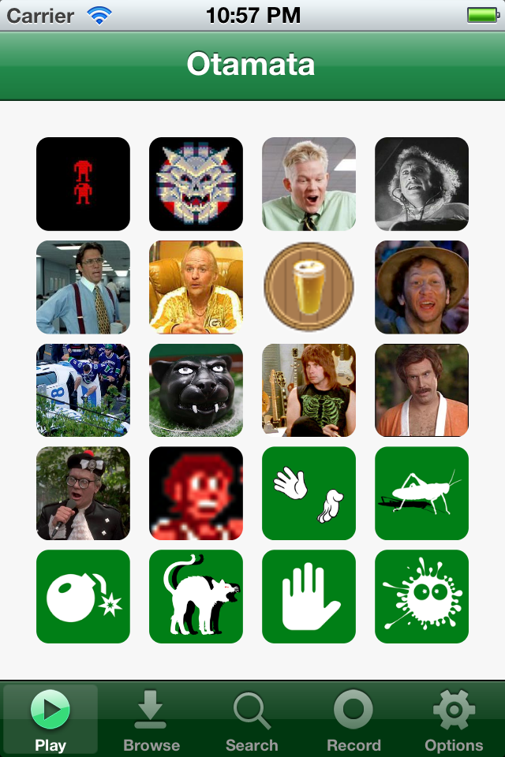
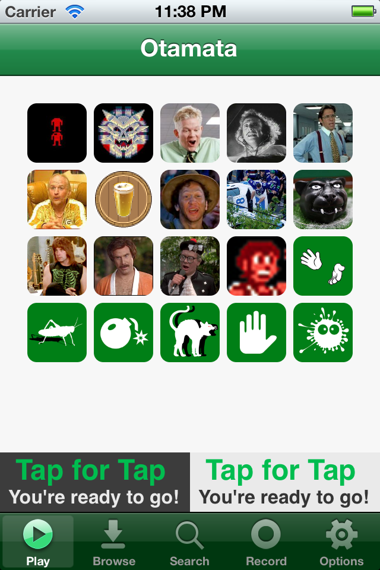
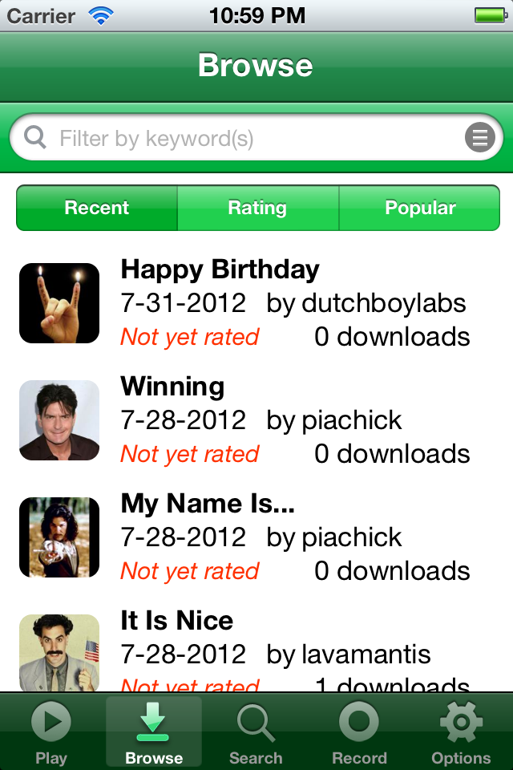
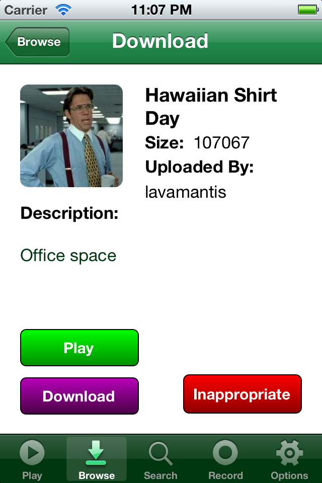
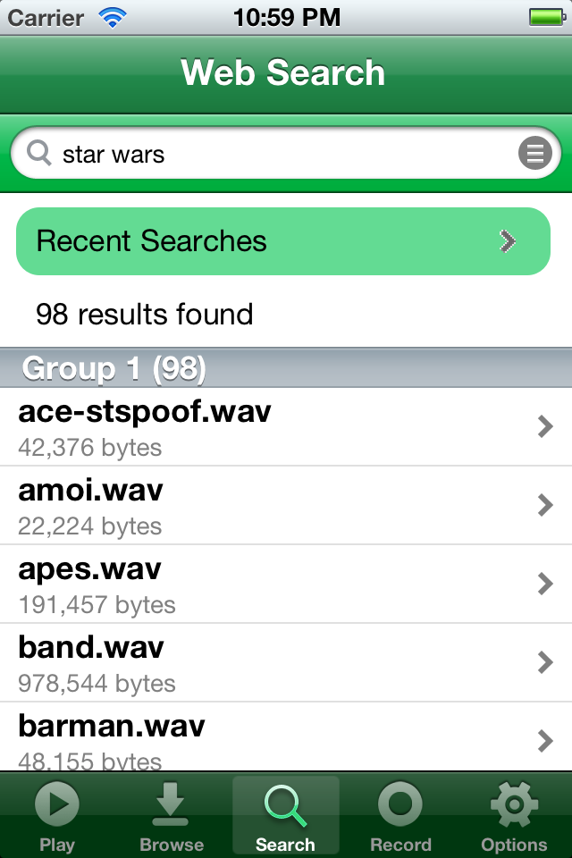
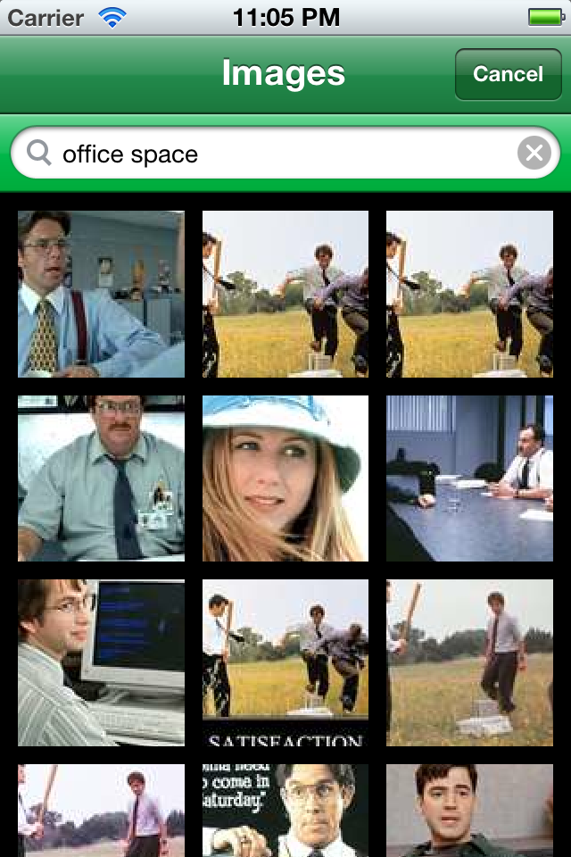
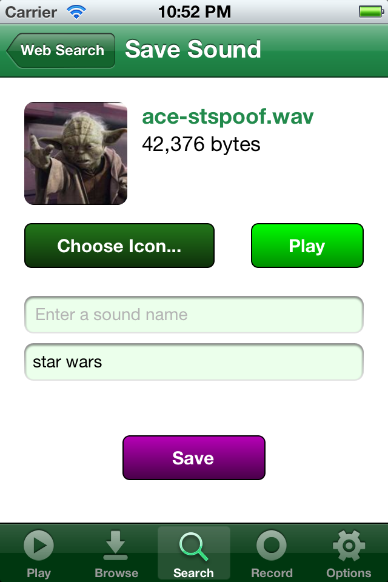
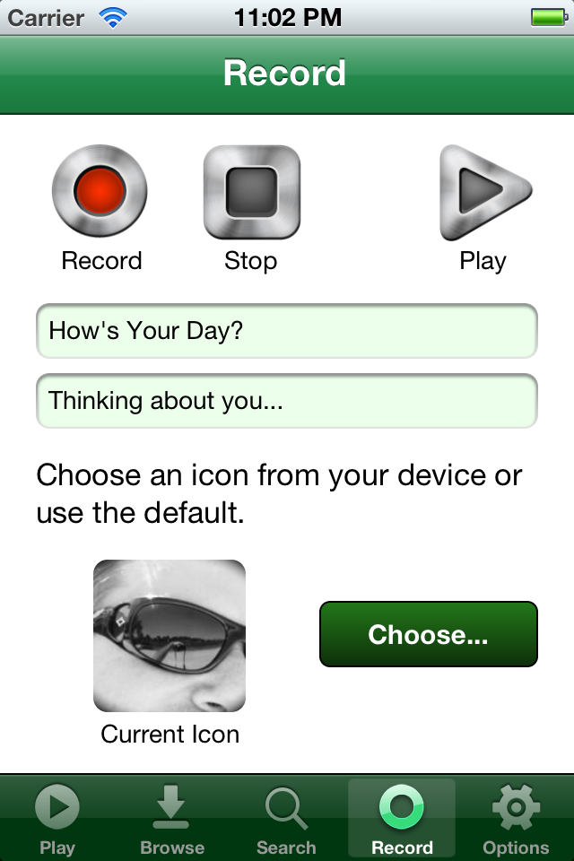
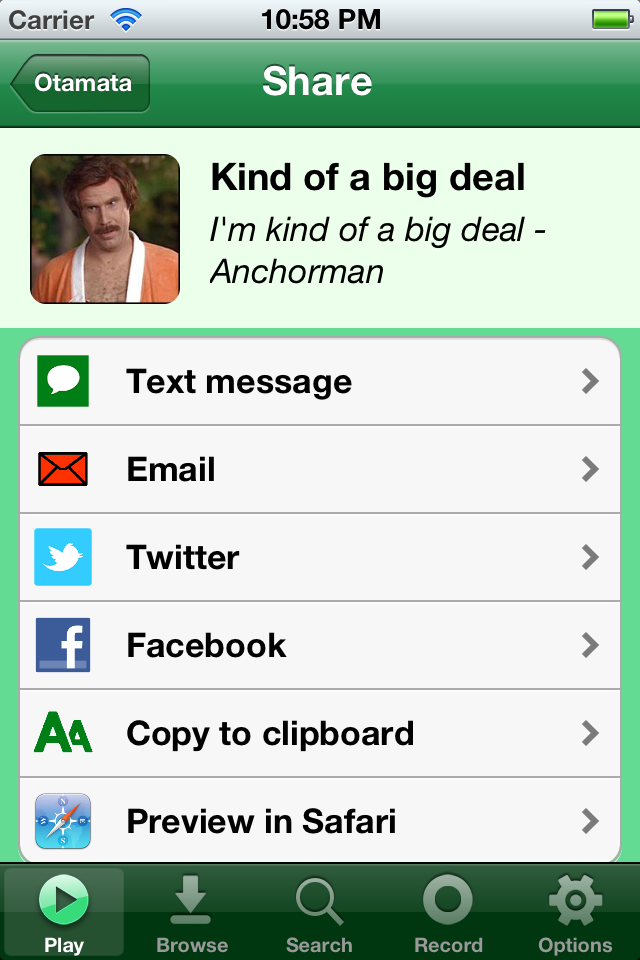
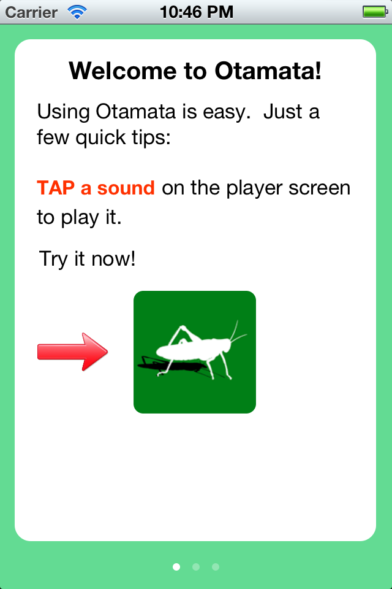

Otamata-iOS
===========

Otamata iOS application
-----------------------

The source code is here mostly for academic purposes.  

Unfortunately, there is some sensitive data in the config.h file, so it's not included here.  So this probably won't compile.  Let me know if you need a version and I can try to create one.

This version of the app failed to be approved by Apple for the app store, although the previous version is currently in the app store.

There's a backend API supporting the app as well, written in C#.  If it's not on Github yet, please check back soon. 

Description
-----------

Enjoy some screenshots of the various UIViewControllers that make up the Otamata iOS app. 

<table cellpadding="10">

<tr>
<td width="200"></td>
<td>The main screen lets you play the perfect sound quickly from your library.</td>
</tr>

<tr>
<td></td>
<td>Those who preferred not to support their friendly neighborhood app developer with a $0.99 in-app purchase saw some ads on the homescreen!</td>
</tr>

<tr>
<td></td>
<td>You can search the sound database by title or a few other options.</td>
</tr>

<tr>
<td></td>
<td>If you like the sound you're browsing, you can add it to your library or report it as inappropriate.</td>
</tr>

<tr>
<td></td>
<td>One feature in the newest release that wasn't approved by Apple is the websearch.  This allowed the user to search
the interwebs for MP3 and WAV clips based on a text search.  This was much easier than having to upload sounds through
the webite.</td>
</tr>

<tr>
<td></td>
<td>Once you found a clip you liked on the web, you could also do an image search to find the perfect icon.  There's also a nice image cropping screen in the app (not shown), which had to be CUSTOM MADE, since (at the time) the built-in image cropper in iOS was private and not accessible to developers.</td>
</tr>

<tr>
<td></td>
<td>Once you're happy with your searched sound, you can go ahead and save it with a title and description.</td>
</tr>

<tr>
<td></td>
<td>You can also record your own sounds inside the app, up to 7 seconds.  These can be private to you, or shared with the sound community.</td>
</tr>

<tr>
<td></td>
<td>What could possibly be more fun than sending the perfect sound effect to your friends!  Press and hold an icon on the main screen to share it (and do some more things, like delete it or rate it 1-5 stars).</td>
</tr>

<tr>
<td></td>
<td>Otamata could not be easier to use, but we still included a brief tutorial for the user when it's first installed.</td>
</tr>

</table>

